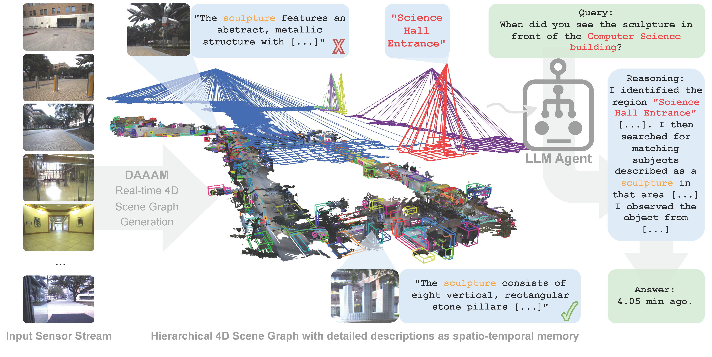

# CVPR 2026: DAAAM - Describe Anything, Anywhere, at Any Moment

[[arXiv](https://arxiv.org/abs/2512.00565)] [[Project Page](https://nicolasgorlo.com/DAAAM_25)]

<p align="center">
  
</p>

Real-time foundation-model-first robot mapping: SAM segmentation + BotSort tracking + VLM grounding feed into [Hydra](https://github.com/MIT-SPARK/Hydra) to build 3D Dynamic Scene Graphs on the fly.

Key contributions:
- Novel optimization-based frontend for semantic descriptions from localized captioning models
- Hierarchical 4D scene graph construction with real-time performance
- State-of-the-art results on NaVQA and SG3D benchmarks

The ROS 2 interface lives in [DAAAM-ROS](https://github.com/MIT-SPARK/DAAAM-ROS).

**[Installation](INSTALL.md) | [Running](RUNNING.md) | [Evaluation](EVAL.md) | [Codebase](CODEBASE.md) | [DAAAM-ROS](https://github.com/MIT-SPARK/DAAAM-ROS)**

## Paper

If you use this code in your work, please cite the following paper:

Nicolas Gorlo, Lukas Schmid, and Luca Carlone, "**Describe Anything, Anywhere, at Any Moment**". *arXiv preprint arXiv:2512.00565*, 2025.

```bibtex
@inproceedings{Gorlo26cvpr-DAAAM,
      title={Describe anything anywhere at any moment},
      author={Gorlo, Nicolas and Schmid, Lukas and Carlone, Luca},
      booktitle={Proceedings of the IEEE/CVF Conference on Computer Vision and Pattern Recognition},
      pages={35002--35013},
      year={2026}
}
```

> This work was supported by the ARL DCIST program and the ONR RAPID program.
